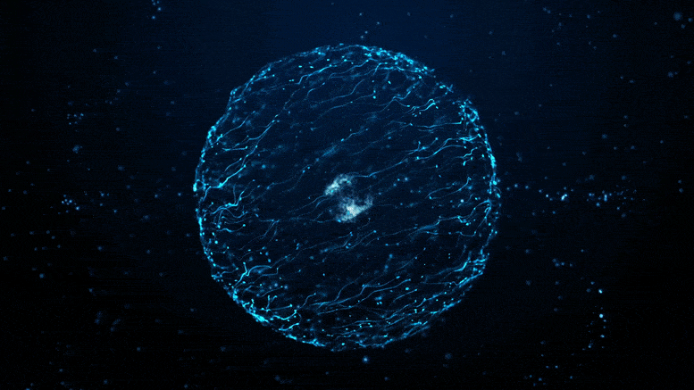

# Project Name: DUNE Sensitivities Simulation (Near Detector)

[](https://github.com/paolominhas/DUNE-GLoBES-Simulation-Internship-2025/actions)
[](https://opensource.org/licenses/MIT)
[](https://github.com/paolominhas/DUNE-GLoBES-Simulation-Internship-2025)

A simulation of the DUNE near and far detectors producing the chi squared results for sterile neutrino oscillation paramaters using GLoBES and the SNU library.

 (taken from Popular Mechanics)

## About The Project

A more detailed paragraph explaining the project's purpose and key features. This project was developed to provide a robust and efficient tool for researchers in quantum computing. It is written in modern C++17 and is designed for scalability on multi-core systems.

**Key Features:**
* Smeared near detector implementation.
* Graphing in python (matplotlib).
* A final package that runs in python.
* Comprehensive test suite using the Catch2 framework.

## Getting Started

Follow these instructions to get a copy of the project up and running on your local machine for development and testing purposes.

### Prerequisites

You will need a C++ compiler supporting C++17, CMake, and the following libraries.

* **g++** (version 9.0 or later)
* **CMake** (version 3.16 or later)
* **Boost Libraries** (version 1.71 or later)
* **Eigen3 Library**

Here is how to install them on a Debian/Ubuntu-based system:
```bash
sudo apt-get update
sudo apt-get install build-essential cmake libboost-all-dev libeigen3-dev
```

### Building from Source

1.  **Clone the repository:**
    ```bash
    git clone [https://github.com/your-username/your-repo.git](https://github.com/your-username/your-repo.git)
    cd your-repo
    ```

2.  **Create a build directory:**
    It's best practice to build the project in a separate directory.
    ```bash
    mkdir build
    cd build
    ```

3.  **Run CMake and build the project:**
    CMake will configure the project, and `make` will compile it.
    ```bash
    # Configure the project
    cmake ..

    # Compile the project (use -j to specify number of CPU cores for faster compilation)
    make -j$(nproc)
    ```
The final executable will be located in the `build/bin/` directory.

## Usage

After building, you can run the main simulator from the `build` directory.
```bash
./bin/qflux_simulator --config ../configs/simulation_config.xml
```

For more detailed usage and configuration options, please refer to the [official documentation](https://your-docs-website.com).

## Running Tests

We use the Catch2 testing framework. To run the test suite, execute the following command from the `build` directory:
```bash
# This will run all tests
make test

# Or run the test executable directly
./bin/run_tests
```

## Contributing

Please feel free to contribute but I have really just written this section to learn how to make a proper readme markdown file. I you would like to learn more about GLoBES go to: or to contribute to new and real physics at DUNE: (because this project is just for me to learn how to use these tools and I would not say it is an amazing resource.)

## License

This project is licensed under the MIT License - see the [**LICENSE**](LICENSE) file for details.

 (taken from Sci Tech)

## Acknowledgments

* Thank you so much Dr Gabreila Vitti Stenico for your help and guidance, as well as the DUNE collaboration, Edinburgh University and especially the School of Physics and Astronomy.
* A big thank you to Joachim Kop for the snu library for implementing sterile neutrinos.